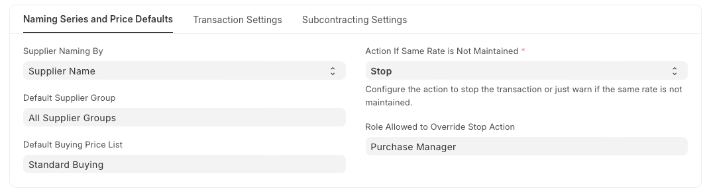
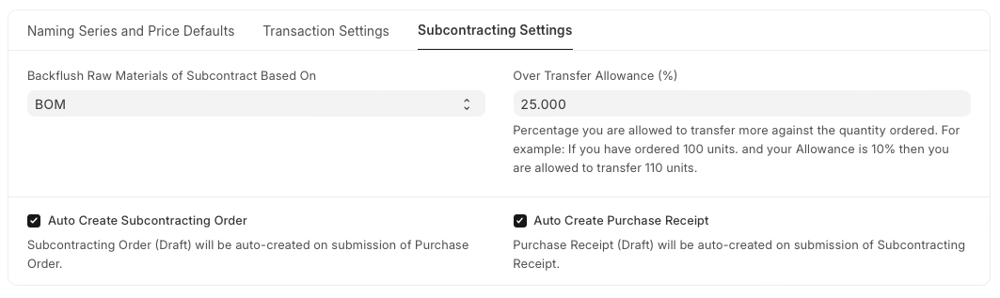

# Buying Settings

It allows you to configure various settings and configurations that help streamline and automate the purchasing workflow.

**Naming Series and Price Defaults** 

 

**1. Supplier Naming By**

When a Supplier is saved, system generates a unique identity or name for that Supplier which can be used to refer the Supplier in various Buying transactions.

If not configured otherwise, it uses the Supplier's Name as the unique name. If you want to identify Suppliers using names like SUPP-00001, SUPP-00002, or such other patterned series, select the value of Supplier Naming By as "Naming Series".

**2. Default Supplier Group**

Configure what should be the default value of Supplier Group when creating a new Supplier. For example, if most of your suppliers supply you hardware, you can set the default as 'Hardware'.

**3. Default Buying Price List**

Configure what should be the default Price List when creating a new Buying transaction, the default is set as 'Standard Buying'. Item prices will be fetched from this Price List. You can modify the 'Price List' by using the arrow at the right-end of the field to change the currency and country.

**4. Action if Same Rate is Not Mentioned** 

It defines the action the should take when it encounters a purchase order, material request, or any other buying transaction where the same rate of an item is not mentioned.

There are two possible actions the user can take.

* Stop: The system will stop the transaction preventing the user from proceeding without specifying a rate. This ensures that all transactions have explicit rates mentioned, avoiding potential discrepancies.
* Warn: The system will allow the transaction happen but will display a warning message to alert the user that the same rate has not been mentioned.

**5. Role Allowed to Override Stop Action**

This setting specifies which user roles have the permission to override the "Stop" action in the buying transaction due to discrepancy in the rate.

**Transaction Settings** 

 

**1. Is Purchase Order Required for Purchase Invoice & Receipt Creation?**

If this option is configured "Yes", it will prevent you from creating a Purchase Invoice or a Purchase Receipt directly without creating a Purchase Order first.

If retail transactions are involved where the order happens offline, then Purchase Orders can be skipped. If you're accepting sample Items, you can directly create a Purchase Receipt to receive the Items to your Warehouse.

This configuration can be overridden for a particular supplier by enabling the "Allow Purchase Invoice Creation Without Purchase Order" checkbox in supplier master

**2. Is Purchase Receipt Required for Purchase Invoice Creation?**

If this option is configured "Yes", it will prevent you from creating a Purchase Invoice without creating a Purchase Receipt first. In case the Item being transacted is a service, it'll not require a receipt, you can directly create an Invoice.

This configuration can be overridden for a particular supplier by enabling the "Allow Purchase Invoice Creation Without Purchase Receipt" checkbox in the supplier master

**3. Blanket Order Allowance (%)**

You can set the percentage you are allowed to order more against the Blanket Order Quantity. For example: If you have a Blanket Order of Quantity 100 units. and your Allowance is 10% then you are allowed to order 110 units.

**4. Update frequency of Project**

It indicates how often should Project be updated of Total Purchase Cost.

**5. Maintain Same Rate Throughout Purchase Cycle**

If this is enabled, it will validate whether an Item's price is changing in a Purchase Invoice or Purchase Receipt created from a Purchase Order, i.e. it will help you maintain the same rate throughout the purchase cycle.

You can configure the action that system should take if the same rate is not maintained in the "Action If Same Rate is Not Maintained" field:

* Stop: it will stop you from changing the price by throwing a validation error.
* Warn: The system will let you save the transaction but warn you with a message if the rate is changed.

Note: This field will only be visible if Maintain Same Rate Throughout Purchase Cycle is enabled.

**6. Allow Item to be added multiple times in a transaction**

When this checkbox is unchecked, an item cannot be added multiple times in the same Purchase Order. However, you can still explicitly change the quantity. This is a validation checkbox for preventing accidental purchase of the same item. This can be checked for specific use cases where there are multiple sources for the same material, for example in manufacturing.

**7. Bill for Rejected Quantity in Purchase Invoice** 

If checked, Rejected Quantity will be included while making Purchase Invoice from Purchase Receipt.

**8. Set Landed Cost Based on Purchase Invoice Rate**

If the 'Maintain Same Rate Throughout the Purchase Cycle' is disabled then this field shows in the buying settings. If user wants to adjust the product valuation as per the purchase invoice cost then this option needs to be enable.

How It Works

1. Created Purchase Receipt for item A with rate as 100
2. System has booked Stock In Hand with 100 rate
3. After 2 days, user has created purchase invoice against the above purchase receipt
4. After 2 days because of change in exchange rate the rate in the invoice changed to 150
5. Now purchase receipt has rate 100 where as Purchase invoice has rate 150
6. If you want to adjust the Stock In Hand with Purchase invoice Rate (150) then enable "Set Landed Cost Based on Purchase Invoice Rate".

Note: on submission of the purchase invoice, system creates the repost item valuation record to update the cost of the purchase receipt. User has to wait to complete the repost item valuation to see the impact of the invoice cost on the stock in hand.

**9. Disable Last Purchase Rate**

It prevents the system from automatically using the rate from the last purchase transaction when creating new purchase orders or transactions.

**10. Use Transaction Date Exchange Rate**

While making Purchase Invoice from Purchase Order, use Exchange Rate on Invoice's transaction date rather than inheriting it from Purchase Order. Only applies for Purchase Invoice.

**Subcontracting Settings**

 

**1. Backflush Raw Materials of Subcontract Based On**

  1. BOM: system will consume raw materials in the subcontracting receipt as per the FG BOM
  2. Material Transferred for Subcontract: system will consume raw materials based on the materials transferred against the Subcontracting Order. If no stock transferred then no materials will be consume at the time of Subcontracting Receipt.

**2. Auto Create Subcontracting Order** 
System will auto create the subcontracting order in a Draft state on submission of the purchase order which has "Is Subcontracted" enabled.

**3. Auto Create Purchase Receipt** 
System will auto create the purchase receipt for the service items in a Draft state on submission of the subcontracting receipt.

**4. Over Transfer Allowance (%)** 
It is the percentage you are allowed to transfer more against the quantity ordered. For example: If you have ordered 100 units. and your Allowance is 10% then you are allowed to transfer 110 units.