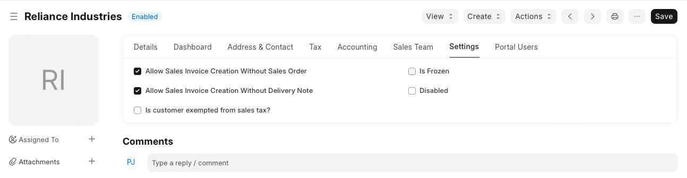

# Customer

**A customer, who is sometimes known as a client, buyer, or purchaser is the one who receives goods, services, products, or ideas, from a seller for a monetary consideration.**

Every customer needs to be assigned a unique id. Customer name itself can be the id or you can set a naming series for ids to be generated in Selling Settings.

To access the Customer list, go to:

`Home > CRM > Sales Pipeline`

Or

`Home > Selling > Customers`

**1. How to create a Customer**

1. Go to the Customer list and click on New.
2. Enter Full Name of the customer.
3. Select Individual if the customer represents an individual or Company if the customer represents a company in Type field.
4. Select a Customer Group. Individual, Commercial, Non Profit and Government are available by default. You can create additional groups if you need.
5. Select the Territory.
6. If the customer is being created against a lead, you can select the same in From Lead field.
7. Save.

You can disallow sales orders and sales invoices against a customer by clicking on 'Disabled'.

`Advanced Tip: If the customer represents one of your own companies then check 'Is Internal Customer'. Check Inter Company Invoices for more details.`

You can also upload customer details via the Data Import Tool.

**2. Features** 

General flow of transactions for a customer is as following:

 

Note: Customers are separate from Contacts and Addresses. A Customer can have multiple Contacts and Addresses.

**2.1 Multiple Contacts and Addresses**

Contacts and Addresses are stored separately so that you can attach multiple Contacts or Addresses to the customer.

**2.2 Allow creation of Sales Invoice without Sales Order and Delivery Note**

If the "Delivery Note Required" or "Sales Order Required" option is configured as "Yes" in Selling Settings, it can be overridden for a particular customer by enabling the "Allow Sales Invoice Creation Without Sales Order" or "Allow Sales Invoice Creation Without Delivery Note" in the Customer Master.

  

**2.3 Set Tax Withholding Category**

You can set the Tax Withholding Category to set up TCS against eligible customers. For more information, visit the Tax Withholding Category page.

**2.4 Default Currency and Price List**

This software supports Multiple Currencies and Price Lists.

You can set the default currency to be used for this customer in sales orders and sales invoices by selecting the appropriate currency in Billing Currency.

Similarly, you can set the default price list to be used for this customer in sales orders and sales invoices by selecting the appropriate currency in Default Price List.

**2.5 Integration with Accounts**

Unlike many accounting software, you need not create a separate accounting ledger for each customer. By default a unified ledger named Debtors is created.

However if you specifically need a separate ledger for a customer, first create the ledger under Accounts Receivable in the Chart of Accounts and then add it in ACCOUNTING section of the customer.

`Advanced Tip: It supports Multi-company Accounting. You can use the same customer records in multiple companies. Since an accounting ledger is company specific, you need to select the company and the corresponding ledger in ACCOUNTING section if you decide have separate accounting ledger for a customer.`

**2.6 Credit Limit and Payment Terms** 

You can set the credit limit by entering the amount in 'Credit Limit' field. Read Credit Limit for more details.

You can select the default Payment Terms to be applied in sales orders and sales invoices in 'Default Payment Terms Template' field.

**2.7 Sales Team and Sales Partner**

If you have one or more Sales Person to manage the sales to the customer, you can add them in SALES TEAM section. If multiple sales person are involved you can split the contribution among them. Make sure that the sum of all sales persons contribution equals to 100%.

Check Sales Persons in Sales Transaction for more details.

A Sales Partner is a third party distributor / dealer / commission agent / affiliate / reseller who facilitates your products/services sales, for a commission. If you sell your products/services to the customer through a sales partner you can set it in 'Sales Partner' field and mention the 'Commission Rate' for calculation of commission.

**2.8 Loyalty Program**

If you would like offer a Loyalty Program to the customer, select the same in Loyalty Program field.

**2.9 View Accounting Ledger and Accounts Receivable** 

Click on Accounting Ledger button to view all accounting transactions with the customer.

Click on Accounts Receivable button to view the details of all outstanding invoices.

**2.10 Set Customer Id, Default Customer Group, Territory, and Price List** 

You can set how a unique id should be generated each the customer in Selling Settings.

 * Naming Series: If you would like a unique id to be generated for each customer based on the naming series select 'Naming Series' in Customer Naming By.
 * Customer Name: If customer name itself should be used as an id then select 'Customer Name' in Customer Naming By. In this case, if you create two customers with identical names, - 1 will be suffixed to the second customer.

You can set the default customer group, territory and price list in Selling Settings.

You can customize the Customer DocType using Customize Form tool.