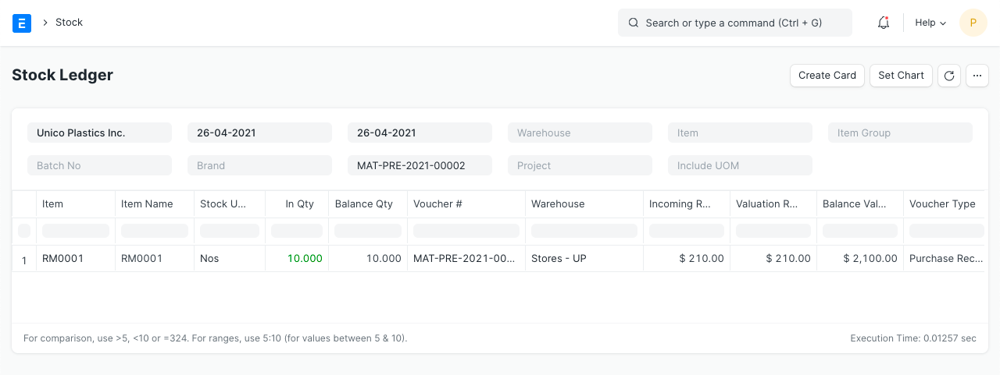
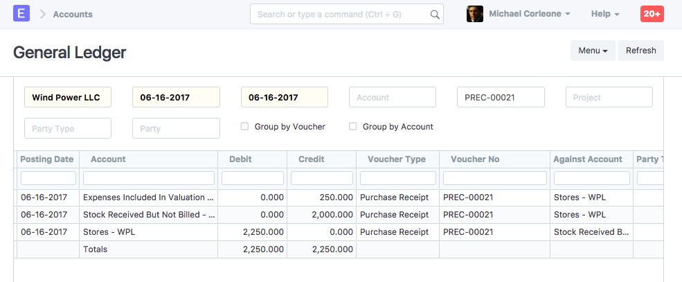
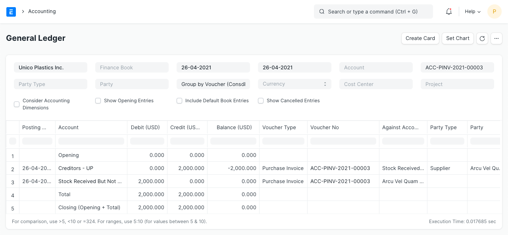
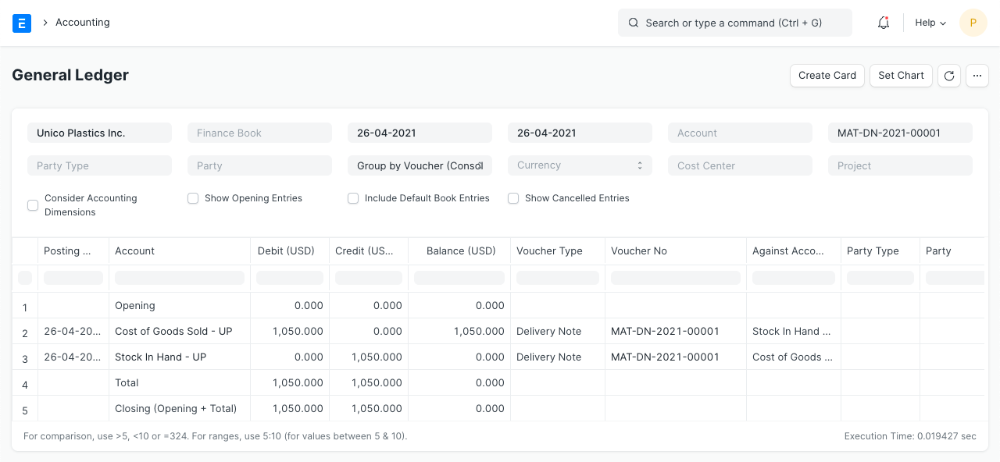
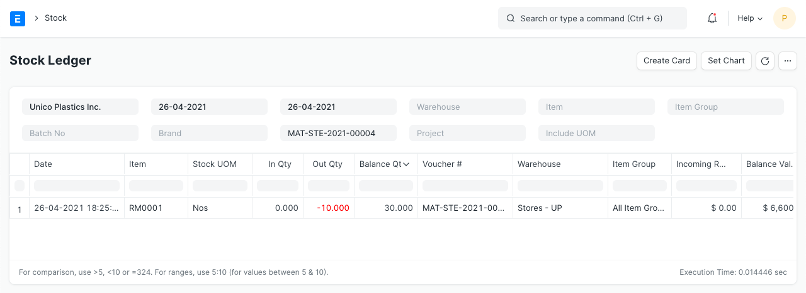
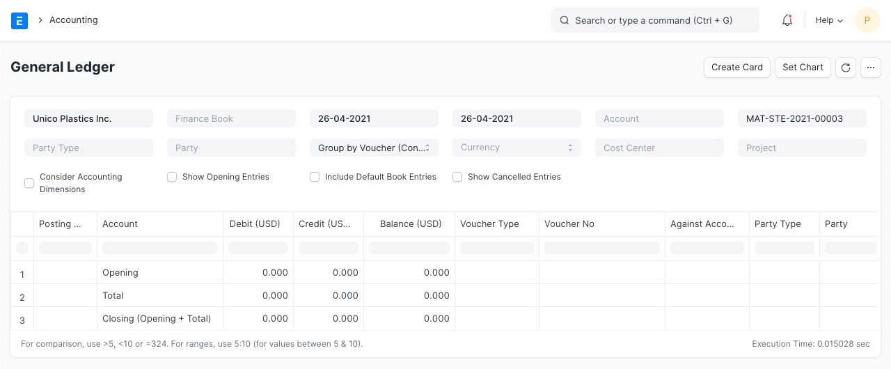

# Perpetual Inventory 

As per the perpetual inventory system, accounting entry is done for every stock transaction. Otherwise, it's done in larger intervals for example monthly or quarterly. Each warehouse is linked with a corresponding account head.

On receipt of items in a particular warehouse, the balance in the Warehouse Account will increase. Similarly, when items are delivered from the Warehouse, an expense will be booked, and the balance in the Warehouse Account will reduce.

**1. How to activate perpetual inventory**

1. Activate Perpetual Inventory:

 `Home > Accounting > Company > Enable Perpetual Inventory`

Note that if you disable perpetual inventory, users will have to manage the account entries manually.

2. Set up the following default accounts for each Company if not set. These accounts are created automatically in the new ERPNext accounts.

  * Default Inventory Account (Asset)
  * Stock Received But Not Billed (Liability)
  * Stock Adjustment Account (Expense)
  * Expenses Included In Valuation (Expense)
  * Cost Center

3. If the user wants to set an individual account for each warehouse, create account head for each account. Go to:

`Accounts > Chart of Accounts > Company > Application of Funds (Assets) > Current Asset > Stock Assets > Create a new account with same name as Warehouse`

Now, go to a warehouse and link this account to the warehouse. This helps in filtering and viewing statements warehouse-wise.

4. For stock transactions, general ledger entries made against the Account Head set on the warehouse, if the user had not set the account for the warehouse then the system gets the account head from the parent warehouse. If Account was not set for parent warehouse then the system gets the account(Default Inventory Account) from the company master.

**2. Example** 
Consider the following Chart of Accounts and Warehouse setup for your company:

Chart of Accounts:

* Assets (Dr)
  * Current Assets
  * Accounts Receivable
  * Debtors
  * Stock Assets
  * Stores
  * Finished Goods
  * Work In Progress
  * Tax Assets
  * VAT

* Liabilities (Cr)
  * Current Liabilities
  * Accounts Payable
  * Creditors
  * Stock Liabilities
  * Stock Received But Not Billed
  * Tax Liabilities
  * Service Tax

* Income (Cr)
  * Direct Income
  * Sales Account

* Expenses (Dr)
  * Direct Expenses
  * Stock Expenses
  * Cost of Goods Sold
  * Expenses Included In Valuation
  * Stock Adjustment
  * Indirect Expenses
  * Shipping Charges
  * Customs Duty

**2.1 Warehouse - Account Configuration**

* Stores
* Work In Progress
* Finished Goods

**2.2 Purchase Receipt**

Suppose you have purchased _10 nos_ of item "RM0001" at _$200_ from supplier "Arcu Vel Quam Fabricators". Following are the details of Purchase Receipt:

**Supplier:** Arcu Vel Quam Fabricators

**Items:**
 
 

**Taxes:**

 

**Stock Ledger**

  

**General Ledger**

  

As stock balance increases through Purchase Receipt, "Store" accounts are debited and a temporary account "Stock Receipt But Not Billed" account is credited, to maintain double-entry accounting system. At the same time, the negative expense is booked in account head having category as "Valuation" or "Total and Valuation" in taxes and charges table for the amount added for valuation purpose, to avoid double expense booking.

**2.3 Purchase Invoice**

On receiving Bill from supplier, for the above Purchase Receipt, you will make Purchase Invoice for the same. The general ledger entries are as follows:

General Ledger

 

Here "Stock Received But Not Billed" account is debited and nullified the effect of Purchase Receipt.

**2.4 Delivery Note**

Let's say, you have an order from "Utah Automation Services" to deliver 5 nos of item "RM0001" at $300. Following are the details of Delivery Note:

**Customer:** Utah Automation Services

**Items:**

   

Taxes:

  

Stock Ledger

  

General Ledger

 

As an item is delivered from "Stores" warehouse, "Stores" account is credited and an equal amount is debited to the expense account "Cost of Goods Sold". The debit/credit amount is equal to the total valuation amount (buying cost) of the selling items. And the valuation amount is calculated based on your preferred valuation method (FIFO / Moving Average) or actual cost of serialized items.

In this example, we have considered the valuation method as FIFO. Valuation Rate = Purchase Rate + Charges Included in Valuation = 200 + (250 / 10) = 225 Total Valuation Amount = 220 * 5 = 1125

**2.5 Sales Invoice with Update Stock**
 
Let's say, you did not make Delivery Note against the above order and instead, you have made Sales Invoice directly, with "Update Stock" options. The details of the Sales Invoice are same as the above Delivery Note.

Stock Ledger

   

General Ledger

   

Here, apart from normal account entries for an invoice, "Stores" and "Cost of Goods Sold" accounts are also affected based on the valuation amount.

**2.6 Stock Entry (Material Receipt)**

**Items:**
 
  

**Stock Ledger**

   

**General Ledger**

  

**2.7 Stock Entry (Material Issue)**

**Items:**

  

**Stock Ledger**

  

**General Ledger**

  

**2.8 Stock Entry (Material Transfer)** 

**Items:**

  

**Stock Ledger**

  

**General Ledger**
 
  
