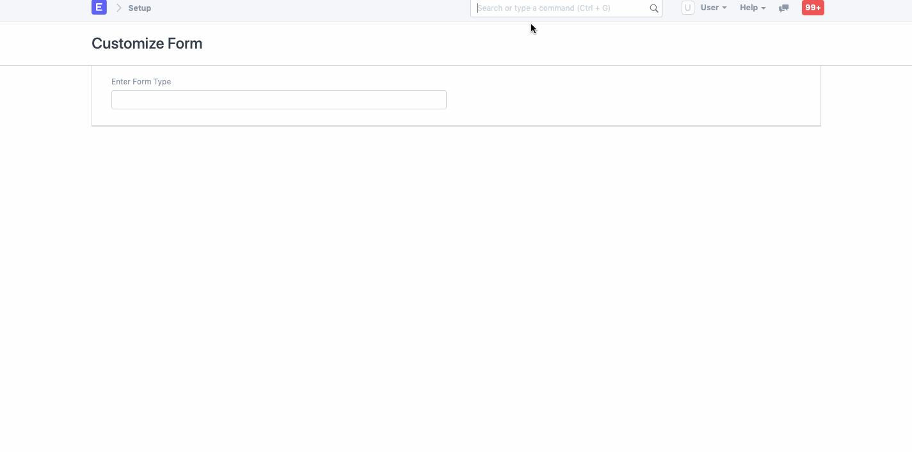
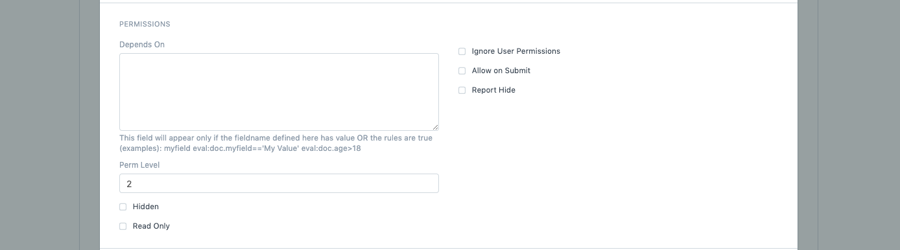
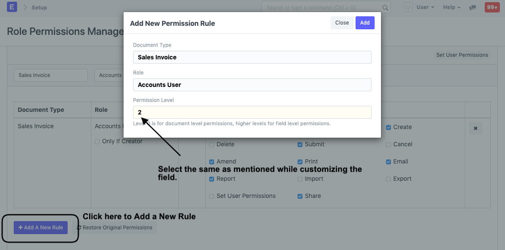
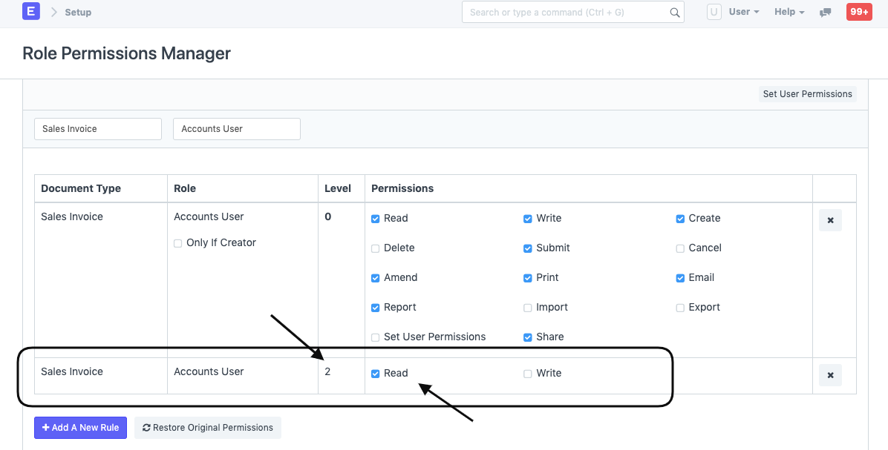
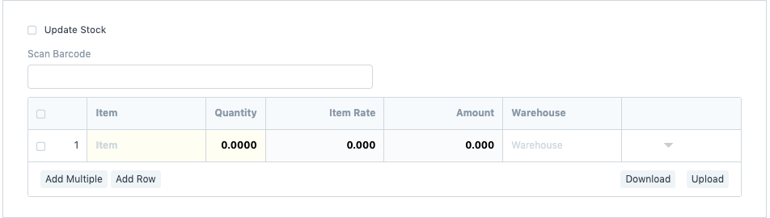

# Field Level Permission Management 

Restricting a field based on Roles can be easily configured using Perm Level, which is required by most organizations. To define a Perm Level, you can go to the respective form and Customize it.

Let's take a scenario where the organization doesn't want its Employee (Accounts User) to edit the Rate of the item while creating a Sales Invoice. To do that, we can simply make the Item Rate field a _read-only_.

1) To achieve this, go to Customize Form, select DocType as Sales Invoice Item, scroll to the Item Rate field and expand it.
 
 

2) Search for the Perm Level, enter the number (0, 1, 2, 3, etc), and _Save_ it.

 

3) Once saved, click on Add a New Rule in Role Permission Manager and select the Document Type and the Role, in our case, _Accounts_ _User_, set the Perm Level as 2 and grant the Employee Read access.

 

This is how the Role Permissions Manager will display the newly created Rule with Perm Level as 2:

 

4) Now, as you can see in the Sales Invoice the User can only read the Item Rate field which will be fetched automatically from the Price List.
 
 

