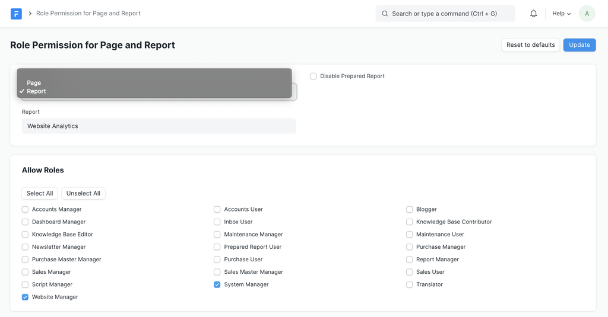
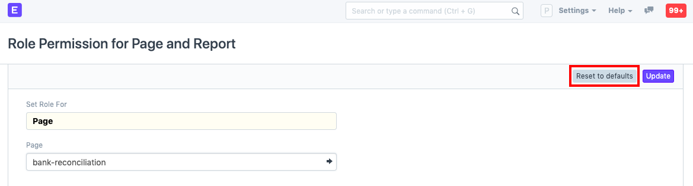
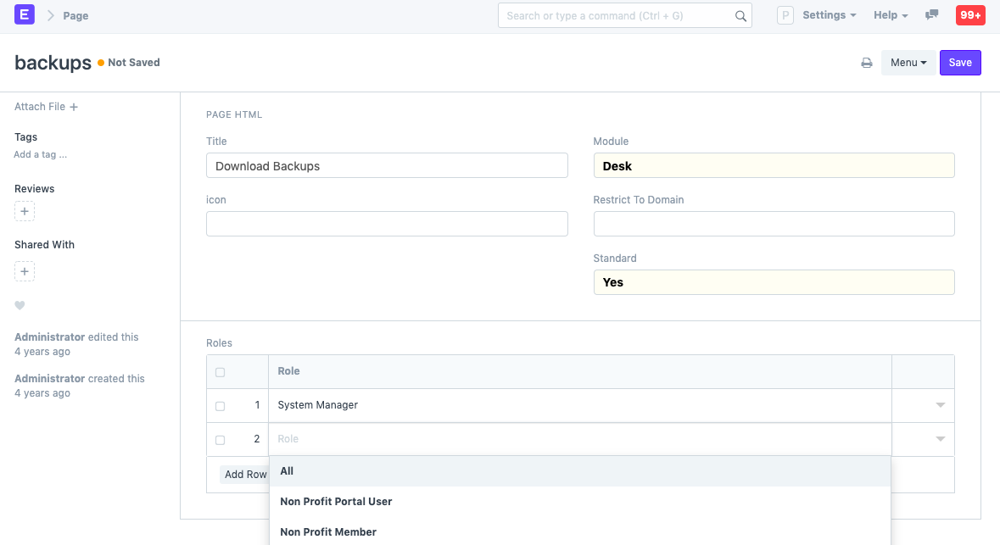
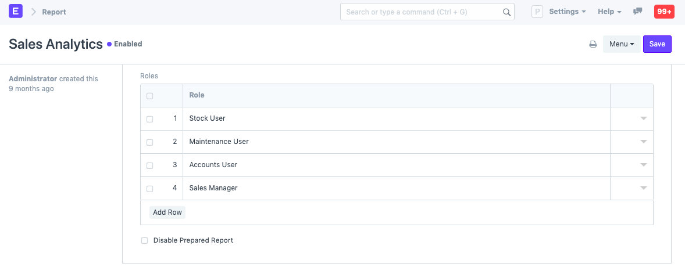

# Role Permission for Page and Report 

**Access to different pages and reports can be controlled in Role Permission for Page and Report.**

Document types are Sales Order, Customer, Supplier, etc. They are a document type meaning they can contain multiple documents of that type. A Page is a single page like Selling Settings. You cannot create multiple Selling Settings, but you can create multiple Sales Orders.

In this software, user can make a custom user interface using Page and a custom report using Report Builder or Query Report. It has a role-based permission system where you can assign roles to the user. The same role can be assigned to the page and report to access them.

If the user has enabled developer mode, then they can add the roles directly in the page and report record. In that case, the permissions will also be reflected in the JSON file for the page/report. Consider you want to restrict the roles that can access certain pages and reports, this can be done via the Role Permission for Page and Report. 

To access Role Permission for Page and Report, go to:

`Home > Users and Permissions > Role Permission for Page and Report`

**1. How to use Role Permission for Page and Report Tool** 

If developer mode is disabled, the user can assign the roles to the page and report, using "Role Permission for Page and Report" page.

 

**1.1 Reset to defaults** 

Using the "Reset to Defaults" button, the user can remove the custom permissions applied on a page or report. Then default permissions will be applicable on that page or report.

 

**Setting Role Permissions from the Page/Report as a Developer**

**Role Permissions For Page**

1. Go to: Home > Developer > Page.
2. Add a row and select which other roles can access the Page.

 

**Role Permissions For Report**

1. Go to: Home > Developer > Report.
2. Add rows with roles who can access the Report.

 