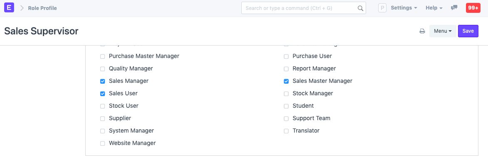

# Role and Role Profile 

**A Role defines the permissions for accessing various documents**

Roles define a set of permissions which can be set from the Roles Permission Manager. Most commonly used roles are already defined in software, you can use the system with them. If needed, you can add more roles. For example, if you assign the Sales User role to a user, they'll be able to access documents like Quotations and Sales Orders since the permissions are already set for the role Sales User.

Role profiles store different roles so that multiple roles can be assigned at once.

Role Profiles act as a template to store and select multiple roles. This Role Profile can then be assigned to a User. For example, a Sales Supervisor will have the roles Employee, Sales Manager, Sales User, and Sales Master Manager. Role Profiles are useful to assign multiple roles at once when adding multiple employees.

To access Role, go to:

`Home > Users and Permissions > Role`

**1. How to add a Role** 

* Go to the Role list, click on New.
* Enter a name for the Role.
* Choose whether the Role has desk access. A role that has desk access can access modules and the company's documents. The level of access depends on the roles assigned to the user.
* Save.

You can add two factor authentication for the role and also restrict it to a specific domain. From here, you can go to the Roles Permission Manager and set permissions for the role across different DocTypes.

**2. How to add a Role Profile**

To access Role Profile, go to:

`Home > Users and Permissions > Permissions > Role Profile`

* Go to the Role Profile list, click on New.
* Enter a name.
* Select the roles you want to assign to this profile.
* Save.

